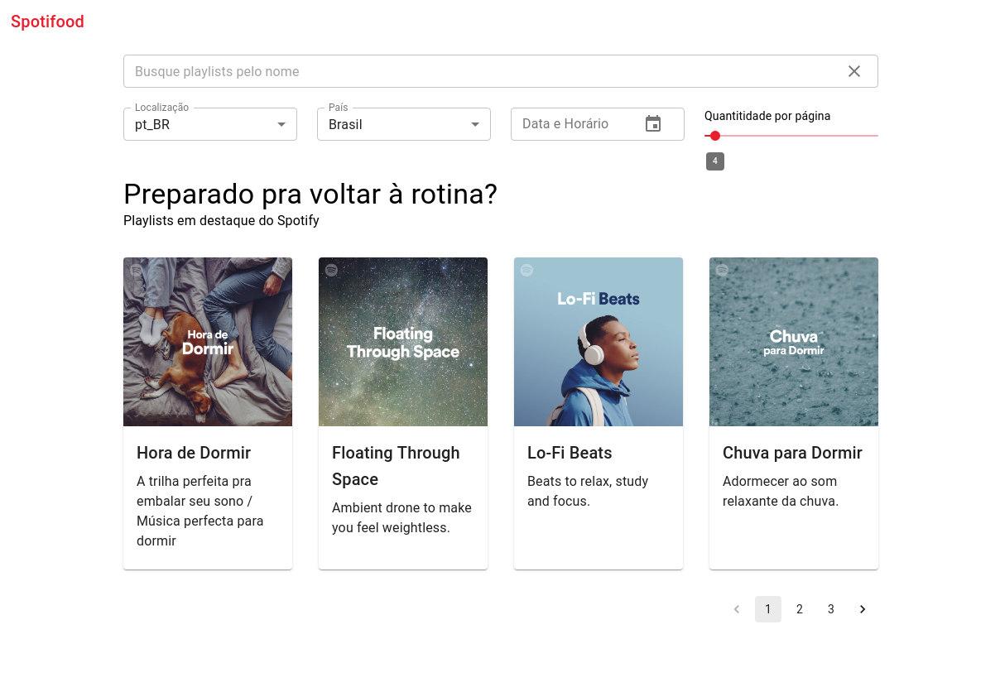
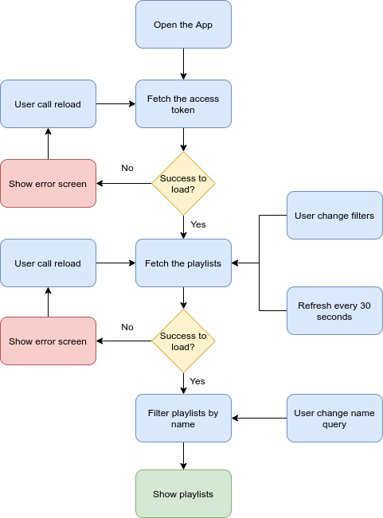

# Spotifood

Spotifood is a project to show a list of featured Spotify's playlists.

The user can filter the data by name using an Search box input or building an API filter with the fields:

- Locale;
- Country;
- Date and Time;
- Page size;
- Page.



To change the project language, select an option on Locale's Select. The common messages (not the API data) are only english and portuguese, [see the next steps](#next-steps).

# Execution

The project fetch data from Spotify's public APIs, to run it an application should be create in the [Spotify's developer dashboard](https://developer.spotify.com/dashboard/applications).

## Environment variables

If you already have created an application, the Spotify will provite two keys:

- Client Id
- Client Secret

Copy these keys to [.env](.env) in the variables:

```
REACT_APP_SPOTIFY_CLIENT_ID: represents the Client Id
REACT_APP_SPOTIFY_CLIENT_SECRET: represents the Client Secret
```

## Running the project

After adding the env variables, execute the following commands:

### Install dependencies

```
yarn install
```

### Start the project

```
yarn start
```

after the start command the project will open a new tab on your browser with the Spotifood project.

## Running the tests

To run all tests, execute the followed command:

```
yarn test
```

## Building the application

To build the application for production, execute the followed command:

```
yarn build
```

# Technical decisions

## Flow

To fetch the data and handle with queries, filters, errors and refresh every 30 seconds, an approach was created inspired by the event-driven architecture.

Every states change that affect the listing will trigger a flow of calls.

The flow diagram presents the solution:



## Libraries

To speed up project creation the [Create React App](https://github.com/facebook/create-react-app) was used.

- [Material UI](https://material-ui.com/) - A complete, fast and customizable React UI Library;
- [Enzyme](https://github.com/enzymejs/enzyme) - A JavaScript test utility;
- [Jest](https://jestjs.io/) - A JavaScript test framework;
- [React i18next](https://github.com/i18next/react-i18next) - An easy adn ready-to-use i18n library;
- [styled-components](https://styled-components.com/) - Simplify and centralize the project styling;
- [date-fns](https://date-fns.org/) - A date helper library;
- [eslint](https://eslint.org/);
- [prettier](http://prettier.io/).

## Additional comments

- The i18n was created only to show a multi-language implementation, to add more languages create a new folder with the locale and a file `translation.json` on [public](/public) dir.
- Only demonstrative tests were created, and real scenario should have a bigger test coverage.
- Add a loading feedback when the filters are changed and when the data is reloaded by the error state component.

## Known bugs

- The provided USA Country filter doesn't work.

# Original test description

Create a web application called Spotifood used to display the preferred playlists from iFood's customers. The web application has only one page:

- A page that lists the featured playlists at Spotify according to some criteria.

## Business rules

- The page is composed of two components:
  - One list of featured playlists
  - One filter component with API filter fields and one local search text input to filter the playlists by "name".
- The filter component should be used to filter the elements displayed by the list of featured playlists.
- The API filter fields and their possible values/type should be mounted by consuming this API **[1. Playlists Filters]** (http://www.mocky.io/v2/5a25fade2e0000213aa90776)
- The featured playlists to be displayed should be consumed from this API **[2. See the documentation from Spotify]** (https://developer.spotify.com/web-api/get-list-featured-playlists/)
- Every time the user change any information on the filter component, the list should be refresh accordingly. In case of API filter field change you should recall the playlists API with the filter parameters every time.
- Considering that we live in a chaotic and fast-changing world, the page should refresh its content every 30 seconds, to see if any information from the Spotify APIs had been changed.

## Hints or Constraints

We will use one API from Spotify Web API. You should follow the Spotify guide in order to create a token needed to access Spotify's API.
To mount the API filter fields on the filter component, you **must** consume the API that provides the metadata about the fields (Link 1).
You could use Material UI, Bootstrap or any other toolkit to accelerate your resolution. We will not provide any UI prototype or design.

## Non functional requirements

As this application will be a worldwide success, it must be prepared to be accessible, responsive, fault tolerant and resilient.
We **strongly recommend** using React to build the application.
Also, briefly elaborate on your solution architecture details, choice of patterns and frameworks.
Fork this repository and submit your code.
